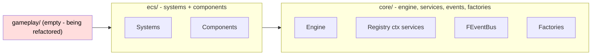
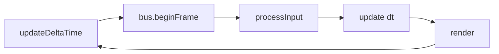

<!-- doc-verify subsystem=architecture commit=b048ebd7fc8c56f474111ec70b2261ccc2222a79 date=2026-08-03 -->
# Architecture

> The big picture of `game01P`: how the layers, the engine lifecycle, the main loop, the ECS, and the context services fit together.

## As-built

### Layering

The codebase is organized into dependency layers. `gameplay/` (the game-logic layer) is currently **empty** on disk — see [RECOVERY.md](RECOVERY.md).

Dependency rule: `core/` ← `ecs/` ← `gameplay/`. `gameplay/` may depend on both lower layers; `ecs/` may depend on `core/`; `core/` must not depend on `ecs/` or `gameplay/`. This keeps `gameplay/` (currently missing) the only place that knows the game rules. Enforced as convention — see [CONVENTIONS.md](CONVENTIONS.md).

### Engine owns the registry and the system manager

The `Engine` (`src/core/Engine.h:22-40`) owns:
- the SDL window + renderer (`src/core/Engine.h:50-51`), via RAII deleters from `src/core/SDLDeleter.h:6`);
- the single `entt::registry` (`src/core/Engine.h:53`);
- the `SystemManager` (`src/core/Engine.h:55`);
- a variable-step `Time` (`src/core/Engine.h:54`);
- optional ImGui overlay renderer callback (`src/core/Engine.h:56`).

Public accessors give read/write access to the registry, renderer, and system manager (`src/core/Engine.h:35-39`).

### Context services (registry.ctx())

Services are created in `Engine::initializeContextServices()` (`src/core/Engine.cpp:72-86`) in a fixed dependency order, and torn down in reverse in `shutdownContextServices()` (`src/core/Engine.cpp:88-106`). Init order:

1. `FInputState` — `src/core/Engine.cpp:76`
2. `FAudioManager` — `src/core/Engine.cpp:77`
3. `FEventBus` (via `InitializeEventBus`) — `src/core/Engine.cpp:78`
4. `FAssetManager` — `src/core/Engine.cpp:79`
5. raw `SDL_Renderer*` — `src/core/Engine.cpp:81`
6. `FResourceManager` (renderer-backed) — `src/core/Engine.cpp:84`

Because resources depend on the renderer, `shutdownContextServices` clears `FResourceManager` first, then removes the renderer ctx, then the rest (`src/core/Engine.cpp:88-106`). Details in [subsystems/core-engine.md](subsystems/core-engine.md).

### Main loop

`Engine::run()` (`src/core/Engine.cpp:108-124`) is the heartbeat:

1. `frameTime.updateDeltaTime()` — variable-step dt (clamped) — `src/core/Engine.cpp:112`
2. `bus->beginFrame()` — clears frame-bound event queues — `src/core/Engine.cpp:115`
3. `processInput()` — SDL events → `FInputState`; ImGui events — `src/core/Engine.cpp:126`
4. `update(dt)` — runs all systems (`systemMgr.updateAll`) — `src/core/Engine.cpp:150-165`
5. `render()` — ImGui frames, clear, `systemMgr.renderAll`, overlay, present — `src/core/Engine.cpp:166-188`

Inside `update()`, all gameplay systems run in registration order (`systemMgr.updateAll`) then audio garbage collection (`src/core/Engine.cpp:154-157`). Inside `render()`, game systems draw after clear and before the ImGui overlay (`src/core/Engine.cpp:177-183`).

### Systems and registration order

`SystemManager` (`src/core/SystemManager.h:19`) stores systems as `unique_ptr<ISystem>` wrappers. Update/render order equals registration order (`src/core/SystemManager.h:17`). Systems are typically header-only structs satisfying `SystemConcept` (`src/ecs/systems/ISystem.h:14`) and wrapped by `SystemWrapper` (`src/ecs/systems/ISystem.h:33`). See [subsystems/ecs.md](subsystems/ecs.md).

**Registration entry point:** the app expects `game::RegisterDefaultSystems(systemManager, registry)` (called from `src/main.cpp:15`). That function is declared in `gameplay/SystemRegistration.h` (`src/main.cpp:4`) — [UNVERIFIED] that header does not exist on disk in the current refactor. Until [RECOVERY.md](RECOVERY.md) is applied, the binary does not link. `src/main.cpp` also calls `BootstrapDemoScene` (`src/main.cpp:16`) and installs the debug overlay (`src/main.cpp:17`).

### Wiring summary (src/main.cpp)

`src/main.cpp:7-23`: construct `Engine` → `initialize()` → `RegisterDefaultSystems` → `BootstrapDemoScene` → `setOverlayRenderer(RenderDebugOverlay)` → `run()` → `shutdown()`.

## Intended / In-progress

- [UNVERIFIED — out/build/macos-clang-debug/CMakeFiles/game01P.dir/src/gameplay/tactical_d20/] The `gameplay/` layer is intended to host the tactical-combat systems (`gameplay/tactical_d20/`) and the system-registration entry (`gameplay/SystemRegistration`). Stale build artifacts under `out/build/.../src/gameplay/` still list these translation units; they were moved out of `gameplay/` by commit `b048ebd` and are not yet restored. See [RECOVERY.md](RECOVERY.md) and [subsystems/tactical-combat.md](subsystems/tactical-combat.md).
- [UNVERIFIED — src/core/Engine.cpp:160] There is a `// TODO: optional state machine update` inside `Engine::update` (`src/core/Engine.cpp:160`) indicating the app-flow `GameStateMachine` may later run here. Today it is never invoked.
- [UNVERIFIED] Data-driven gameplay values were intended to load from an `assets/data/` directory. `assets/data/` does not exist on disk (see [RECOVERY.md](RECOVERY.md)).

## Cross-references

- [ONBOARDING.md](ONBOARDING.md) — how to build/run.
- [CONVENTIONS.md](CONVENTIONS.md) — the rules these patterns enforce.
- [subsystems/core-engine.md](subsystems/core-engine.md) — engine + services in depth.
- [subsystems/ecs.md](subsystems/ecs.md) — systems and components in depth.
- [subsystems/events.md](subsystems/events.md) — FEventBus dispatch in depth.
- [RECOVERY.md](RECOVERY.md) — the broken-build state.
